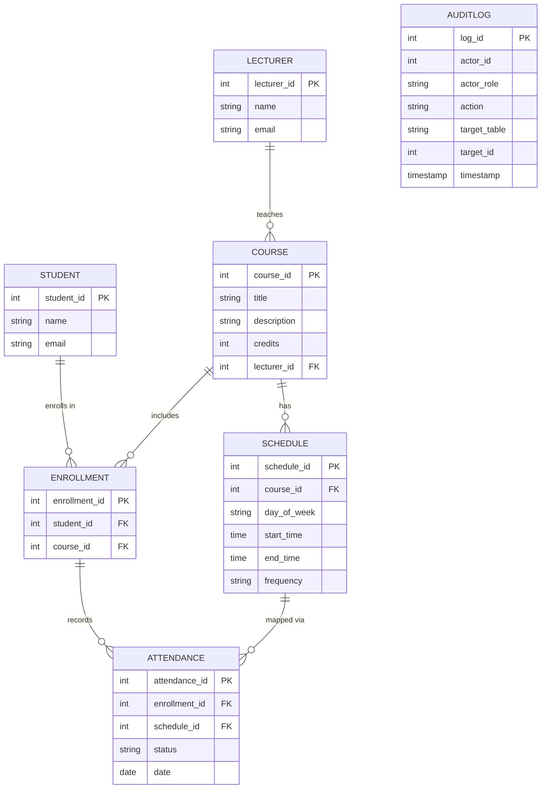
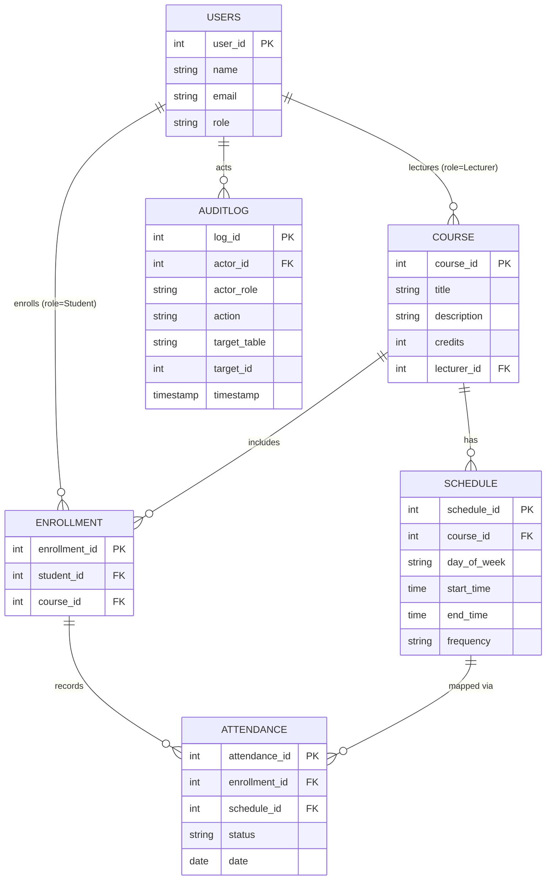

# Database Design Documentation

## Overview
This document describes the database design for the **Course Scheduling and Attendance Management System**.  
The design process follows the **Conceptual → Logical → Physical** approach.  
It supports core actors: **Lecturers**, **Students**, and **Administrators**, while ensuring traceability and accountability through **audit logging**.

---

## 1. Conceptual Design (ERD Level)
### ERD



At the conceptual level, we identify the main entities, their attributes, and relationships.

### Entities
- **Student**
  - Attributes: StudentID, Name, Email, etc.
- **Lecturer**
  - Attributes: LecturerID, Name, Email, etc.
- **Course**
  - Attributes: CourseID, Title, Description, Credits
- **Schedule**
  - Attributes: ScheduleID, DayOfWeek, StartTime, EndTime, Frequency
- **Enrollment**
  - Attributes: EnrollmentID, StudentID, CourseID
- **Attendance**
  - Attributes: AttendanceID, EnrollmentID, ScheduleID, Status, Date
- **AuditLog**
  - Attributes: LogID, ActorID, ActorRole, Action, TargetTable, TargetID, Timestamp

### Relationships
- A **Lecturer** teaches one or many **Courses**.
- A **Course** can have many **Schedules**.
- A **Student** can enroll in many **Courses** (via **Enrollment**).
- A **Schedule** can have many **Attendance** records (linked through **Enrollment**).
- All key system actions are recorded in **AuditLog**.

---

## 2. Logical Design (Relational Schema)
At the logical level, we unify Student, Lecturer, and Admin into a single Users table with a role-based approach.
This avoids duplication and simplifies authentication/authorization.

### Tables & Relationships


### Tables & Relationships

- **Users**: Holds Students, Lecturers, and Admins.

- **Course**: Linked to a Lecturer via lecturer_id.

- **Schedule**: Defines when a course occurs.

- **Enrollment**: Links Students to Courses.

- **Attendance**: Tracks presence for each scheduled session.

- **AuditLog**: Records all actions, referencing Users.

---

## 3. Physical Design (Implementation Level)

### Database Engine
- **PostgreSQL**
  ```SQL
  CREATE TABLE Users (
    user_id UUID PRIMARY KEY DEFAULT gen_random_uuid(),
    email VARCHAR(255) UNIQUE NOT NULL,
    password_hash VARCHAR(255) NOT NULL,
    first_name VARCHAR(100) NOT NULL,
    last_name VARCHAR(100) NOT NULL,
    role VARCHAR(20) CHECK (role IN ('ADMIN','LECTURER','STUDENT')) NOT NULL,
    employer_id VARCHAR(50),
    registration_number VARCHAR(50),
    is_active BOOLEAN DEFAULT FALSE,
    profile_picture VARCHAR(255),
    created_at TIMESTAMP NOT NULL DEFAULT NOW(),
    updated_at TIMESTAMP NOT NULL DEFAULT NOW(),
    email_verified BOOLEAN DEFAULT FALSE,
    email_verification_token VARCHAR(255),
    email_verification_token_expiry TIMESTAMP,
    password_reset_token VARCHAR(255),
    password_reset_token_expiry TIMESTAMP
  );


  CREATE TABLE Course (
      course_id SERIAL PRIMARY KEY,
      title VARCHAR(255) NOT NULL,
      description TEXT,
      credits INT NOT NULL,
      lecturer_id INT REFERENCES Users(user_id),
      created_at TIMESTAMP DEFAULT NOW(),
      updated_at TIMESTAMP DEFAULT NOW()
  );
  
  CREATE TABLE Schedule (
      schedule_id SERIAL PRIMARY KEY,
      course_id INT REFERENCES Course(course_id),
      day_of_week VARCHAR(10) CHECK (day_of_week IN ('Mon','Tue','Wed','Thu','Fri','Sat','Sun')),
      start_time TIME NOT NULL,
      end_time TIME NOT NULL,
      frequency VARCHAR(50),
      created_at TIMESTAMP DEFAULT NOW(),
      updated_at TIMESTAMP DEFAULT NOW()
  );
  
  CREATE TABLE Enrollment (
      enrollment_id SERIAL PRIMARY KEY,
      student_id INT REFERENCES Users(user_id),
      course_id INT REFERENCES Course(course_id),
      created_at TIMESTAMP DEFAULT NOW(),
      updated_at TIMESTAMP DEFAULT NOW()
  );
  
  CREATE TABLE Attendance (
      attendance_id SERIAL PRIMARY KEY,
      enrollment_id INT REFERENCES Enrollment(enrollment_id),
      schedule_id INT REFERENCES Schedule(schedule_id),
      status VARCHAR(20) CHECK (status IN ('Present','Absent','Late','Excused')),
      date DATE NOT NULL,
      created_at TIMESTAMP DEFAULT NOW(),
      updated_at TIMESTAMP DEFAULT NOW()
  );
  
  CREATE TABLE AuditLog (
      log_id SERIAL PRIMARY KEY,
      actor_id INT REFERENCES Users(user_id),
      actor_role VARCHAR(20) CHECK (actor_role IN ('Student','Lecturer','Admin')),
      action VARCHAR(50) NOT NULL,
      target_table VARCHAR(50),
      target_id INT,
      timestamp TIMESTAMP DEFAULT NOW()
  );
  ```

### Constraints & Indexing
- **Primary Keys**: all ID fields.
- **Foreign Keys**: enforce referential integrity between entities.
- **Unique Constraints**: on `email` for both Student and Lecturer.
- **Indexes**:
  - `idx_student_email` on Student.email
  - `idx_lecturer_email` on Lecturer.email
  - `idx_course_lecturer` on Course.lecturer_id
  - `idx_enrollment_student_course` on (student_id, course_id)
  - `idx_attendance_enrollment_schedule` on (enrollment_id, schedule_id)

### Audit Logging Strategy
- Insert into `AuditLog` table on every CRUD operation.
- For Admin, all critical actions (create/remove course, update lecturer assignment, delete student) must generate audit logs.
- Logs should be immutable: no update/delete allowed.

---

## 4. Supported Use Cases

### Lecturer
- Retrieve students enrolled in their courses (via `Enrollment`).
- View assigned courses (via `Course`).
- Track attendance and identify missing students (via `Attendance`).
- Generate reports (query joins on Course → Enrollment → Attendance).

### Student
- View schedules of enrolled courses (via `Schedule` + `Enrollment`).
- Track attendance metrics (via `Attendance`).

### Admin
- Create/manage courses and assign lecturers.
- Full visibility of system data.
- Troubleshoot issues by reviewing **AuditLog**.
- Remove or deactivate courses if needed.

---

## 5. Future Enhancements
- **Role-based Access Control (RBAC)**: Fine-grained permissions.
- **Soft Deletes**: Instead of permanent deletion, use `is_active` flags and log actions.
- **Reporting Views**: Predefined SQL views for dashboards.
- **Partitioning**: Attendance and AuditLog tables can be partitioned by date for scalability.
